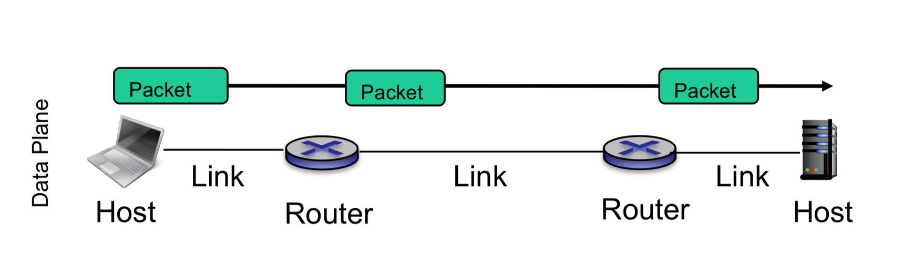

# Socket API

> The socket API is a collection of socket calls that enable you to perform the following primary communication functions between application programs: Set up and establish connections to other users on the network.

## **components**

- **Hosts**: Transmit and receive application packets of length **L**

- **Routers**: Store and **forward** packets from one link to another

- **Links**: **Propagate** packets within the link

> A router may also act as a host e.g. management

### **client**

1. Set up a socket and specify service needed _(UDP, TCP, etc)_

2. Send a message

   1. message and the length

   2. who and where the message is being sent to

      1. IP address: unique identifier for the host (interface)

      2. Port: 16 bit identifier of a process that is sending and receiving data (ex. port 8080)

### **server**

1. Set up a socket and specify the service needed

2. Specify the IP address and port to listen on

3. Receive a message / request; `receive(message, source_ip_address, port)`

4. Send the message

   1. message

   2. client IP and port

#### common ports

- 80: web servers listen on port 80

- 25: SMTP for sending email

- 53: DNS servers listen on posrt 53

- 0-1023: values are reversed for standard, well-known services
